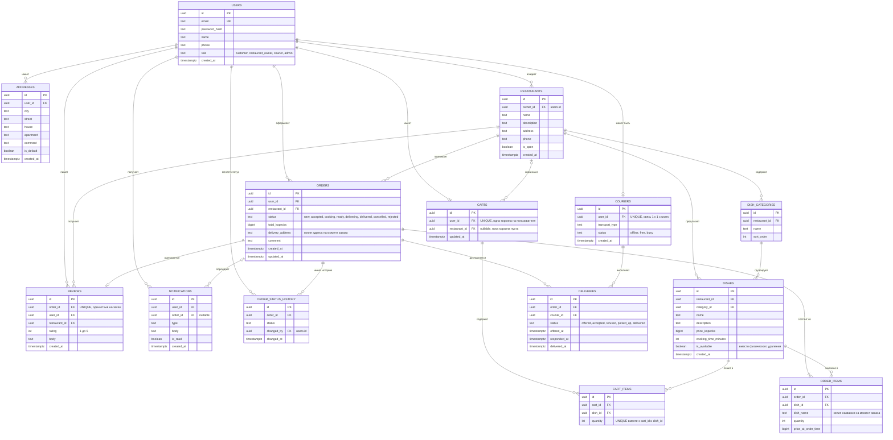

```mermaid
erDiagram
    USERS ||--o{ ADDRESSES : "имеет"
    USERS ||--o| COURIERS : "может быть"
    USERS ||--o{ RESTAURANTS : "владеет"
    USERS ||--o| CARTS : "имеет"
    USERS ||--o{ ORDERS : "оформляет"
    USERS ||--o{ REVIEWS : "пишет"
    USERS ||--o{ NOTIFICATIONS : "получает"
    USERS ||--o{ ORDER_STATUS_HISTORY : "меняет статус"
 
    RESTAURANTS ||--o{ DISH_CATEGORIES : "содержит"
    RESTAURANTS ||--o{ DISHES : "предлагает"
    DISH_CATEGORIES ||--o{ DISHES : "группирует"
    RESTAURANTS |o--o{ CARTS : "корзина из"
    RESTAURANTS ||--o{ ORDERS : "принимает"
    RESTAURANTS ||--o{ REVIEWS : "получает"
 
    CARTS ||--o{ CART_ITEMS : "содержит"
    DISHES ||--o{ CART_ITEMS : "лежит в"
 
    ORDERS ||--|{ ORDER_ITEMS : "состоит из"
    DISHES ||--o{ ORDER_ITEMS : "заказано в"
    ORDERS ||--o{ ORDER_STATUS_HISTORY : "имеет историю"
    ORDERS ||--o{ DELIVERIES : "доставляется"
    ORDERS ||--o| REVIEWS : "оценивается"
    ORDERS |o--o{ NOTIFICATIONS : "порождает"
 
    COURIERS ||--o{ DELIVERIES : "выполняет"
 
    USERS {
        uuid id PK
        text email UK
        text password_hash
        text name
        text phone
        text role "customer, restaurant_owner, courier, admin"
        timestamptz created_at
    }
 
    ADDRESSES {
        uuid id PK
        uuid user_id FK
        text city
        text street
        text house
        text apartment
        text comment
        boolean is_default
        timestamptz created_at
    }
 
    COURIERS {
        uuid id PK
        uuid user_id FK "UNIQUE, связь 1 к 1 с users"
        text transport_type
        text status "offline, free, busy"
        timestamptz created_at
    }
 
    RESTAURANTS {
        uuid id PK
        uuid owner_id FK "users.id"
        text name
        text description
        text address
        text phone
        boolean is_open
        timestamptz created_at
    }
 
    DISH_CATEGORIES {
        uuid id PK
        uuid restaurant_id FK
        text name
        int sort_order
    }
 
    DISHES {
        uuid id PK
        uuid restaurant_id FK
        uuid category_id FK
        text name
        text description
        bigint price_kopecks
        int cooking_time_minutes
        boolean is_available "вместо физического удаления"
        timestamptz created_at
    }
 
    CARTS {
        uuid id PK
        uuid user_id FK "UNIQUE, одна корзина на пользователя"
        uuid restaurant_id FK "nullable, пока корзина пуста"
        timestamptz updated_at
    }
 
    CART_ITEMS {
        uuid id PK
        uuid cart_id FK
        uuid dish_id FK
        int quantity "UNIQUE вместе с cart_id и dish_id"
    }
 
    ORDERS {
        uuid id PK
        uuid user_id FK
        uuid restaurant_id FK
        text status "new, accepted, cooking, ready, delivering, delivered, cancelled, rejected"
        bigint total_kopecks
        text delivery_address "копия адреса на момент заказа"
        text comment
        timestamptz created_at
        timestamptz updated_at
    }
 
    ORDER_ITEMS {
        uuid id PK
        uuid order_id FK
        uuid dish_id FK
        text dish_name "копия названия на момент заказа"
        int quantity
        bigint price_at_order_time
    }
 
    ORDER_STATUS_HISTORY {
        uuid id PK
        uuid order_id FK
        text status
        uuid changed_by FK "users.id"
        timestamptz changed_at
    }
 
    DELIVERIES {
        uuid id PK
        uuid order_id FK
        uuid courier_id FK
        text status "offered, accepted, refused, picked_up, delivered"
        timestamptz offered_at
        timestamptz responded_at
        timestamptz delivered_at
    }
 
    REVIEWS {
        uuid id PK
        uuid order_id FK "UNIQUE, один отзыв на заказ"
        uuid user_id FK
        uuid restaurant_id FK
        int rating "1 до 5"
        text body
        timestamptz created_at
    }
 
    NOTIFICATIONS {
        uuid id PK
        uuid user_id FK
        uuid order_id FK "nullable"
        text type
        text body
        boolean is_read
        timestamptz created_at
    }
```
